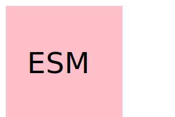

# SVG Logo Generator
    
    ## Introduction
    
    This is a producto to help design a  SVG Llogo using inputs from  the user.
    
    ## Table of Contents
    
    - [Installation](#installation)
    - [Use](#use)
    - [Contributers](#contributers)
    - [License](#liscense)
    
    ## Installation
    
    The  process is used in the terminal.
    
    ## Use
    
    The user will be prompted by the product to answer some questions to get an idea of that the user wants for their end piece. Once the user completes the questions a SVG logo wil be generated for them.
    
    ## Contributers

    Evan Miller

    ## Example and Demo

    

    *Demo [video](https://drive.google.com/file/d/1y6b6GepICyQP3m_5HZnw7Mmg1n0l9s3M/view)

    ## License

    MIT
    